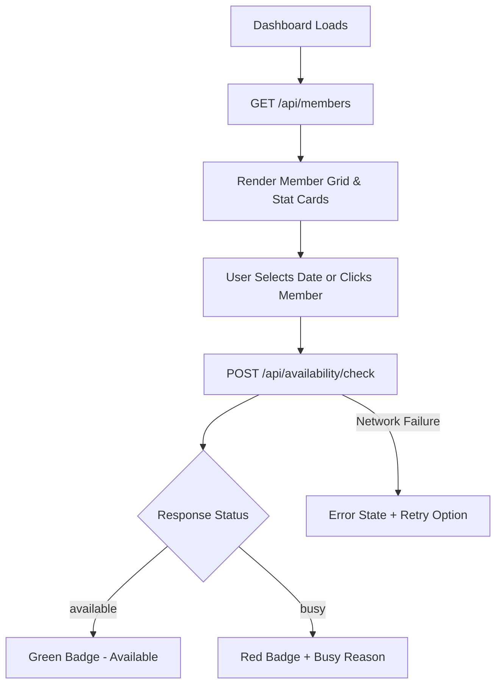

# MoraSpirit Member Availability Dashboard

[](https://nextjs.org/)
[](https://react.dev/)
[](https://www.typescriptlang.org/)
[](https://tailwindcss.com/)

A modern, responsive team availability dashboard built for **MoraSpirit** to track team members' status, schedule duties, and query availability across any date in real time.

---

## 🚀 Features

- **Live Member Directory**: Fetches and displays all MoraSpirit team members with custom avatars and MSP IDs.
- **Real-Time Availability Check**: Single-member and batch availability checking against backend API endpoints.
- **Interactive Calendar & Date Selection**: Instantly inspect availability for today or any target date.
- **Search & Filter**: Filter team members dynamically by name, role, or MSP ID.
- **Summary Metrics & Statistics**: Real-time summary cards highlighting total team count, available members, and busy members.
- **Detailed Member Inspection Sidebar**: View full member details, check custom dates, and view last-checked timestamps.
- **Resilient Error & Loading States**: Skeleton UI loaders, granular error handling per card, and single-click retry options.

---

## 🛠 Tech Stack & Architecture

| Layer | Technology | Purpose |
|---|---|---|
| **Framework** | Next.js 16 (App Router) | Server/Client components, file-based routing |
| **Library** | React 19 | UI component logic & hooks |
| **Language** | TypeScript 5 | Strict typing for API contracts and component props |
| **Styling** | Tailwind CSS v4 | Responsive utilities & modern UI aesthetics |
| **Icons** | Lucide React | Clean, modern UI icon system |
| **Deployment** | Vercel | Seamless deployment |

### Data Flow



---

## 📂 Project Structure

```
Member_dashboard/
├── moraspirit-dashboard/        # Next.js App Router Application
│   ├── app/
│   │   ├── globals.css          # Tailwind CSS & global styles
│   │   ├── layout.tsx           # Main application layout
│   │   └── page.tsx             # Main dashboard page & state orchestration
│   ├── components/
│   │   ├── Header.tsx           # Navigation bar with search & date controls
│   │   ├── StatCards.tsx        # Overview summary cards
│   │   ├── FilterBar.tsx        # Search, date picker, & batch action bar
│   │   ├── MemberGrid.tsx       # Member grid container & loading/error states
│   │   ├── MemberCard.tsx       # Individual member card component
│   │   └── DetailSidebar.tsx    # Selected member inspection panel
│   ├── lib/
│   │   ├── api.ts               # API fetch utilities (fetchMembers, checkAvailability)
│   │   ├── avatars.ts           # Custom avatar generator logic
│   │   └── types.ts             # TypeScript interface definitions
│   ├── public/                  # Static assets
│   ├── .env.local               # Environment variables
│   ├── package.json
│   └── tsconfig.json
└── README.md
```

---

## 🔌 API Integration

The dashboard integrates with the following MoraSpirit API endpoints:

### 1. Fetch Member List
- **Endpoint**: `GET /api/members`
- **Response**:
```json
{
  "count": 12,
  "members": [
    {
      "id": "MSP001",
      "name": "Thisuka Kodithuwakku",
      "role": "CMO"
    }
  ]
}
```

### 2. Check Member Availability
- **Endpoint**: `POST /api/availability/check`
- **Request Body**:
```json
{
  "msp_id": "MSP001",
  "date": "2026-09-18"
}
```
- **Response**:
```json
{
  "requested_date": "2026-09-18",
  "id": "MSP001",
  "name": "Thisuka Kodithuwakku",
  "role": "CMO",
  "status": "busy",
  "reason": "Attending University Sports Council Meeting"
}
```

## 📄 License

This project was created for the **MoraSpirit Web Pillar Recruitment Task**.
