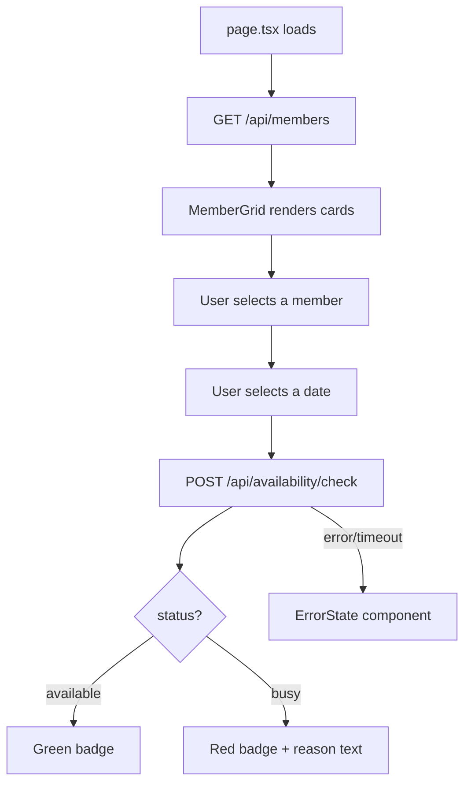

# MoraSpirit Member Availability Dashboard — Workflow & Architecture

**Task:** Web Pillar Recruitment Task 01
**Stack:** Next.js (App Router) + TypeScript + Tailwind CSS
**Deployment target:** Vercel

---

## 1. Tech Stack

| Layer | Choice | Why |
|---|---|---|
| Framework | Next.js 14+ (App Router) | Built-in routing, server/client component split, easy Vercel deploy |
| Language | TypeScript | Type safety for API response shapes |
| Styling | Tailwind CSS | Fast, responsive, consistent design tokens |
| Data fetching | Native `fetch` + React state (or SWR/TanStack Query) | Simple caching + revalidation for the two endpoints |
| Date picking | `react-day-picker` or native `<input type="date">` | Keep it lightweight |
| Hosting | Vercel | Zero-config Next.js deploys |
| Repo | GitHub (public) | Required for interview walkthrough |

---

## 2. Project Structure

```
moraspirit-dashboard/
├── app/
│   ├── layout.tsx
│   ├── page.tsx                 # Main dashboard page
│   └── globals.css
├── components/
│   ├── MemberGrid.tsx           # Renders member cards
│   ├── MemberCard.tsx           # Single member (avatar, name, role)
│   ├── DateSelector.tsx         # Date input / calendar
│   ├── AvailabilityBadge.tsx    # Green/red indicator + reason
│   ├── LoadingState.tsx
│   └── ErrorState.tsx
├── lib/
│   ├── api.ts                   # fetchMembers(), checkAvailability()
│   └── types.ts                 # Member, AvailabilityResponse types
├── hooks/
│   └── useAvailability.ts       # Encapsulates check logic + state
├── public/
├── .env.local                   # API_BASE_URL
├── next.config.js
├── tailwind.config.ts
└── README.md
```

---

## 3. Data Flow / Architecture



### Component responsibilities
- **`page.tsx`** — orchestrates state: `members`, `selectedMember`, `selectedDate`, `availability`, `loading`, `error`.
- **`MemberGrid` / `MemberCard`** — pure presentational, receive `members` and `onSelect` as props.
- **`DateSelector`** — controlled input, emits `onDateChange`.
- **`useAvailability` hook** — fires `checkAvailability()` whenever both member + date are set; owns loading/error/result state for that specific call (separate from the member-list loading state).
- **`AvailabilityBadge`** — dumb component, just renders color + reason from the result object.

---

## 4. State Management Plan

Keep it local — no Redux/Zustand needed for this scope:

1. **Member list state**: fetched once on mount (`useEffect` or React Query `useQuery`), cached.
2. **Selection state**: `selectedMemberId`, `selectedDate` — simple `useState` in `page.tsx`.
3. **Availability check state**: separate `loading` / `error` / `data` per check, reset whenever selection changes, so a stale result never flashes for a new selection.
4. Debounce or guard so a check only fires when **both** member and date are chosen.

---

## 5. API Integration (`lib/api.ts`)

```ts
const BASE_URL = process.env.NEXT_PUBLIC_API_BASE_URL; // https://task.moraspirit.com

export async function fetchMembers(): Promise<Member[]> {
  const res = await fetch(`${BASE_URL}/api/members`);
  if (!res.ok) throw new Error("Failed to load members");
  const data = await res.json();
  return data.members;
}

export async function checkAvailability(msp_id: string, date: string) {
  const res = await fetch(`${BASE_URL}/api/availability/check`, {
    method: "POST",
    headers: { "Content-Type": "application/json" },
    body: JSON.stringify({ msp_id, date }),
  });
  if (!res.ok) throw new Error("Availability check failed");
  return res.json(); // { status, reason?, ... }
}
```

---

## 6. Error Handling Checklist

- [ ] Member list fetch fails → show `ErrorState` with retry button, not a blank page.
- [ ] Member list returns empty array → show "No members found" message.
- [ ] Availability check fails (network/5xx) → show inline error near the badge, don't crash the page.
- [ ] Availability check returns unexpected shape → guard with optional chaining + fallback text.
- [ ] Loading states: skeleton cards for member grid, spinner for availability check (scoped to the badge area only, not the whole page).

---

## 7. UI/UX Notes

- Responsive grid: `grid-cols-1 sm:grid-cols-2 lg:grid-cols-3` for member cards.
- Accessibility: badge color paired with text/icon (not color alone) — e.g. ✅ Available / ⛔ Busy.
- Keyboard-navigable member selection (buttons, not divs with onClick only).
- Clear empty/initial state: "Select a member and date to check availability."

---

## 8. Build & Delivery Workflow

1. **Scaffold**: `npx create-next-app@latest moraspirit-dashboard --typescript --tailwind --app`
2. **Build `lib/types.ts` and `lib/api.ts`** first — lock down the data contracts.
3. **Build static UI** with mock data (MemberGrid, MemberCard, AvailabilityBadge).
4. **Wire up real API calls** (member list, then availability check).
5. **Add loading/error states** throughout.
6. **Polish responsiveness + accessibility pass.**
7. **Write README.md** — setup instructions, env vars, architecture summary.
8. **Push to public GitHub repo.**
9. **Deploy to Vercel**, verify env vars are set there too.
10. **Rehearse walkthrough**: be ready to explain component structure, state choices, and error handling decisions.

---

## 9. Environment Variables

```
NEXT_PUBLIC_API_BASE_URL=https://task.moraspirit.com
```

---

## 10. Stretch Goals (if time permits)

- Search/filter members by name or role.
- Cache availability results per member+date in session to avoid duplicate calls.
- Dark mode via Tailwind's `dark:` variants.
- Skeleton loaders instead of spinners for a more polished feel.
